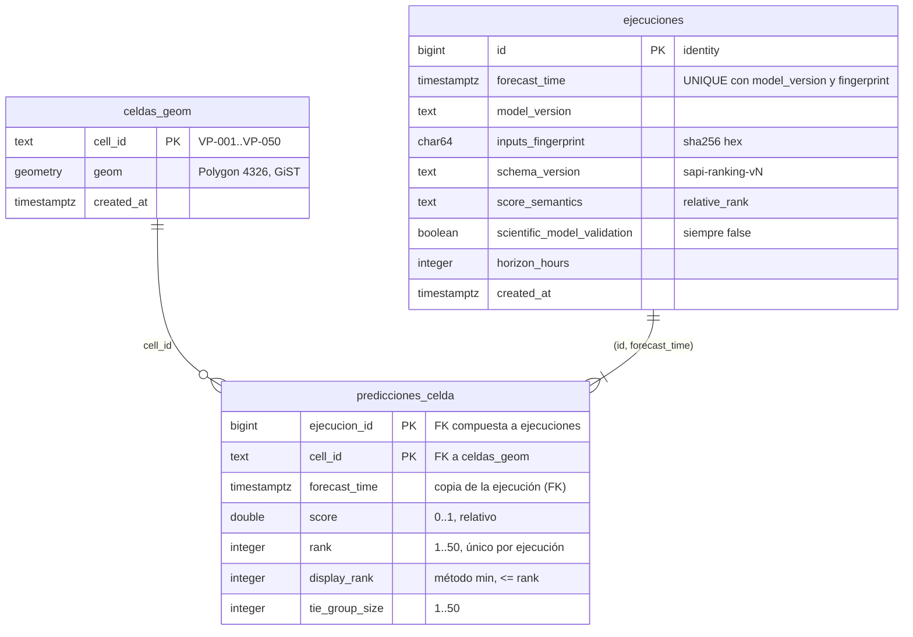

# Esquema operacional v2 — PostgreSQL/PostGIS (SAPI-58)

Persistencia de la arquitectura S.A.P.I. v2: cada ejecución del Modelo D y su
ranking de las 50 celdas, alineada con el contrato
`contracts/openapi/ml-service.v0.yaml` (`RankingResult` / `CellRanking`).

El score es un **ranking relativo** entre las 50 celdas de una misma
ejecución, no un valor calibrado de ocurrencia de incendio
(`scientific_model_validation = false`, fijado también por un CHECK).

## Migraciones (fuente canónica)

`db/migration/` es la única fuente del esquema v2, con nombres compatibles con
Flyway. No vive dentro de Spring: el backend (SAPI-59) consume este esquema y no
guarda copia de las migraciones. Quién las ejecuta en runtime (Flyway vía
Docker Compose) se decide en SAPI-59/SAPI-60.

| Archivo | Contenido |
|---|---|
| `V001__enable_postgis.sql` | Habilita PostGIS |
| `V002__create_sapi_v2_schema.sql` | Tablas `celdas_geom`, `ejecuciones`, `predicciones_celda`, constraints e índices |
| `V003__seed_celdas_geom.sql` | Las 50 celdas. **Generado** por `scripts/generate_celdas_geom_seed.py` desde `src/geo/grid.py::all_cells()`; no editar a mano |

El esquema legacy de `docker/initdb/` (clasificado `LEGACY_ONLY`) no se modifica
ni se reutiliza: sus tablas usan granularidad diaria, un campo con semántica de
probabilidad y círculos aproximados en vez de las cajas reales de la grilla.

## Modelo entidad-relación



**Claves e integridad**
- `ejecuciones`: clave natural `UNIQUE(forecast_time, model_version, inputs_fingerprint)`, base de la inserción idempotente de SAPI-59.
- `predicciones_celda`: `PK(ejecucion_id, cell_id)`, `UNIQUE(ejecucion_id, rank)`, FK compuesta `(ejecucion_id, forecast_time)` → `ejecuciones(id, forecast_time)` con `ON DELETE CASCADE`, FK `cell_id` → `celdas_geom`.
- Índices: GiST sobre `celdas_geom.geom`; `(cell_id, forecast_time DESC)` para el historial por celda; `ejecuciones(forecast_time DESC)` para la última ejecución.
- `forecast_time` es `timestamptz`: el pipeline trabaja en buckets de 6 h, no por día.
- "Exactamente 50 filas por ejecución" no se puede expresar con un CHECK: lo garantiza quien persiste (SAPI-59), escribiendo la ejecución y sus 50 filas en una transacción.

## Por qué PostgreSQL + PostGIS (y no MongoDB)

Resumen de ADR-003 y §2 de `docs/architecture-stack-freeze-sprint2.md`:
- **Ranking e historial**: los datos son relacionales (ejecución → 50 filas → celda) y se consultan con joins, orden por rank y filtros por fecha; las FK y los CHECK protegen esas invariantes en la propia base.
- **Geometría**: PostGIS guarda las celdas como polígonos con índice GiST y permite consultas espaciales (intersección, área, contención) sin otra herramienta.
- **Reproducibilidad**: el esquema es SQL versionado y se aplica igual en un contenedor limpio.
- MongoDB quedó `NOT_ADOPTED`: no hace falta un segundo motor y JSONB cubre metadata flexible si llega a necesitarse.

## Verificación

- **Estática** (pytest y Release Gate, sin conexión a ninguna BD): `tests/test_db_migrations_v2.py`.
- **Integración** en un PostGIS **efímero y dedicado** (nombre único, sin volumen, sin puerto publicado; se borra siempre al terminar; ignora `DATABASE_URL`):

```powershell
powershell -ExecutionPolicy Bypass -File scripts\sapi58_migration_integration.ps1 -LogPath sapi58.log
```

Aplica V001→V003 con `ON_ERROR_STOP`, inspecciona tablas, índices, 50 celdas
válidas en SRID 4326 sin solaparse (~14,9 km² cada una) y comprueba que FK y
CHECK rechazan datos inválidos. La Release Gate **no** valida esta migración viva:
solo ejecuta los tests estáticos.
