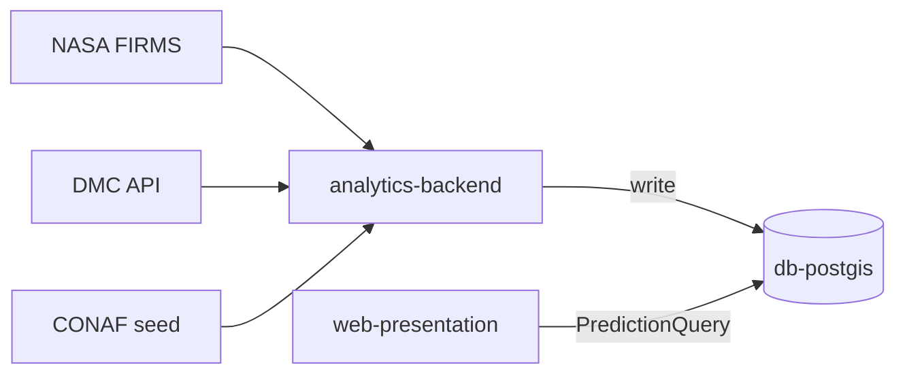

# Arquitectura S.A.P.I. — Prototipo Funcional UAT

Sistema de Alerta y Predicción de Incendios para la Región de Valparaíso.
Prototipo académico con **50 celdas** de demo (~11,5 km² c/u) optimizado para latencia < 0.2s.

## Contenedores Docker Compose

```mermaid
flowchart LR
  FIRMS[NASA FIRMS] --> ANA[analytics-backend]
  DMC[DMC API] --> ANA
  CONAF[CONAF seed] --> ANA
  ANA -->|write| DB[(db-postgis)]
  WEB[web-presentation] -->|PredictionQuery| DB
```

| Servicio | Puerto | Rol |
|----------|--------|-----|
| `db-postgis` | 5432 | SSoT PostGIS |
| `analytics-backend` | — | Bucle 24h `run_daily` |
| `web-presentation` | 8501 | Streamlit dashboard |

## Data Contract

- `app/` **solo** consume `PredictionQuery` (`src/query/prediction_query.py`)
- Prohibido: importar `src.ingesta`, `src.procesamiento`, `src.modelo`, `src.pipeline` desde frontend
- Validado por `tests/test_architecture.py` (AST estático)

## Tablas PostGIS

| Tabla | Rol |
|-------|-----|
| `staging_incendios` | Focos NASA/CONAF |
| `staging_meteo` | Telemetría DMC |
| `matriz_features` | Features ML |
| `predicciones_riesgo` | **Serving Layer** (mapa) |
| `observability_logs` | Auditoría |

## Resiliencia R-03

`ParallelIngester` ante falla de red:
1. Reintentos `tenacity`
2. Fallback `staging_*` PostGIS (7 días)
3. Seed institucional CONAF embebido

## ML (prototipo)

- Baseline: Random Forest; producción demo: XGBoost + SMOTE (train split temporal) — pipeline implementado y funcional
- Recall/AUC-ROC de producción: **sin corrida real todavía** (hallazgo de métricas fabricadas en `reports/metrics.json`, corregido en commit `c22c9a1` — ver [`docs/matriz-riesgo.md`](matriz-riesgo.md), R-ETIQUETA-01)
