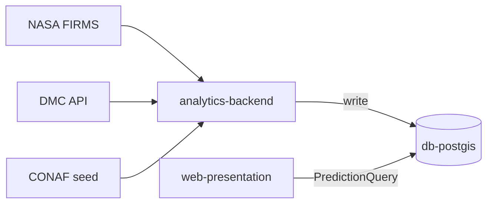

# Informe 1 — Seminario de Licenciatura (INSW421)

**Proyecto:** S.A.P.I. — Sistema de Alerta y Predicción de Incendios Forestales
**Ramo:** INSW421, Seminario de Licenciatura
**Profesor:** César
**Fecha:** 02-09-2026
**Hito de evaluación:** Hito 1 — 07-09-2026
**Indicadores de logro cubiertos:** IL 1.1, IL 1.2, IL 1.3, IL 1.4

---

## IL 1.1 — Riesgos potenciales

El proyecto mantiene una matriz de riesgo activa desde el inicio del sprint de cobertura (ver [`docs/matriz-riesgo.md`](matriz-riesgo.md)), con 6 riesgos identificados, cada uno respaldado por evidencia verificable en el repositorio — no por estimación cualitativa sin trazabilidad.

### Riesgos cerrados con evidencia

| ID | Riesgo | Evidencia de cierre |
|----|--------|----------------------|
| **R-NASA-FIRMS-01** | Disponibilidad y cobertura temporal de detecciones satelitales NASA FIRMS | Backfill real de 5 años (2021-08-30 a 2026-08-30), 12.477 registros, manifest con conteos verificables (`data/processed/nasa_firms_2021-08-30_2026-08-30_manifest.json`) |
| **R-COBERTURA-01** | Cobertura de pruebas automatizadas por debajo del umbral de calidad | Umbral 80% en `pytest.ini`/CI **superado**: 221/221 tests, **84.07%** de cobertura (corrida real 02-09-2026) |

### Riesgos abiertos, por severidad

| ID | Riesgo | Estado | Probabilidad |
|----|--------|--------|---------------|
| **R-DMC-01** | Cobertura de estaciones meteorológicas DMC limitada a una estación validada (330007, Rodelillo) | Abierto, mitigado parcialmente | Media |
| **R-CONAF-01** | Histórico CONAF sin fuente de datos real integrada (stub) | Abierto, diferido a Sprint 2 | Media |
| **R-INTEGRACION-01** | El flujo de riesgo por celda (`matriz_features`/`predicciones_riesgo`) y el flujo de join ignición↔meteo (SAPI-28/32) no están conectados en producción | Abierto — **avance real documentado el 02-09-2026** (ver IL 1.3) | Alta (ya materializado) |
| **R-ETIQUETA-01** | La etiqueta de entrenamiento `ignicion` proviene de una regla sintética (30-30-30), nunca de una detección satelital real confirmada; su correlación con incendios reales no está validada | Abierto — investigación exploratoria en curso | Alta (ya materializado) |

**Nota sobre R-ETIQUETA-01, hallazgo del 02-09-2026:** al ampliar la ventana de análisis a 5 años de histórico NASA FIRMS con meteo DMC real, se identificó el primer caso (celda VP-025, fecha 2022-12-11) donde la regla 30-30-30 se cumple usando datos 100% reales de punta a punta — 6 detecciones satelitales reales dentro del polígono de la celda, meteo real sin fuga de datos. Es un solo caso, no cambia la conclusión general del riesgo (todavía abierto), pero es la primera coincidencia verificada entre regla sintética e ignición real sin ningún dato sintético de por medio.

### Riesgo adicional gestionado esta sesión (integridad de métricas)

Aunque no tiene ID propio en la matriz formal, vale mencionar el hallazgo del 01-09-2026 (commit `c22c9a1`): las métricas de Recall/AUC-ROC citadas en el informe hasta esa fecha (0.78/0.83) resultaron ser valores de mock de test copiados a `reports/metrics.json`, nunca una corrida real del pipeline. Fue corregido en código (`app/utils/metrics_loader.py` ya no enmascara resultados reales de 0.0/NaN) y en documentación. Hoy el proyecto **no** reporta una métrica de recall/AUC-ROC de producción — reporta honestamente que no existe todavía, con un exploratorio acotado (n=12 incendios reales, Sprint 2) como línea de investigación abierta, no como sustituto.

---

## IL 1.2 — Estructura de la propuesta

### Problema y objetivo

S.A.P.I. aborda la predicción probabilística de focos de ignición forestal en la interfaz urbano-forestal de mayor exposición demográfica de la Región de Valparaíso: el corredor **Viña del Mar – Quilpué – Villa Alemana**. El prototipo académico demuestra viabilidad técnica de arquitectura, no cobertura regional completa (ver [`docs/alcance-prototipo.md`](alcance-prototipo.md)).

### Arquitectura técnica

Tres servicios Docker Compose (ver [`docs/arquitectura.md`](arquitectura.md)):

| Servicio | Rol |
|----------|-----|
| `db-postgis` | Fuente única de verdad (SSoT) espacial |
| `analytics-backend` | Bucle de ingesta/procesamiento/entrenamiento (`run_daily`) |
| `web-presentation` | Dashboard Streamlit (puerto 8501) |

**Contrato de datos:** el frontend (`app/`) consume exclusivamente `PredictionQuery` — tiene prohibido importar `src.ingesta`, `src.procesamiento`, `src.modelo` o `src.pipeline` directamente, validado estáticamente por `tests/test_architecture.py` (análisis AST).

Tablas PostGIS: `staging_incendios`, `staging_meteo`, `matriz_features` (features ML), `predicciones_riesgo` (serving layer del mapa), `observability_logs` (auditoría).

**Resiliencia (R-03):** ante falla de red, `ParallelIngester` aplica reintentos (`tenacity`), luego fallback a `staging_*` de los últimos 7 días, luego seed institucional CONAF embebido.

### Alcance del prototipo vs. informe académico

El prototipo distingue explícitamente qué es demostración de arquitectura y qué sería producción real:

| Aspecto | Prototipo (Hito 1) | Informe / producción futura |
|---------|---------------------|------------------------------|
| Meteo | Perfiles zonalmente calibrados en el seed demo | Ingesta horaria DMC en vivo |
| Topografía | DEM real (Copernicus GLO-30) implementado y procesado — altitud/pendiente/orientación reales por celda | Cobertura regional completa |
| Cobertura espacial | 50 celdas (~11,5 km² c/u), corredor VP-001 a VP-050 | 100% Región de Valparaíso |
| Mapa del dashboard (Hito 1) | `SAPI_DATA_MODE=demo_seed` — escenario sembrado en memoria | `postgis_inference` (Sprint 2) |

Esta distinción no es cosmética: existe un mecanismo de software (`SAPI_DATA_MODE`) y una constante verificada en código (`_render_data_mode_badge()`) que declara qué fuente alimenta el mapa en cada momento — evita que el prototipo aparente ser más de lo que es.

**Fuera de alcance de este prototipo:** cobertura 100% del territorio en PostGIS, ingesta 24h automatizada en cloud, export PDF institucional, integración webhooks SENAPRED, despliegue AWS ECS/RDS/Airflow, capas antrópicas adicionales.

---

## IL 1.3 — Hitos del desarrollo según metodología

### Metodología

El proyecto se desarrolla bajo **Scrum**, con un calendario de **5 sprints** hacia la entrega final. El Hito 1 de evaluación (07-09-2026) coincide con el cierre de **Sprint 1**.

> **Nota para completar:** el calendario de fechas de Sprint 2 a Sprint 5 no está documentado en el repositorio de código — corresponde al cronograma del curso/syllabus. Completar con las fechas reales antes de la entrega final del informe.

### Estado real de Sprint 1 (confirmado contra Jira, 02-09-2026)

**6 tareas de gestión/documentación — Finalizado:**

| Ticket | Contenido |
|--------|-----------|
| SAPI-33 | Gestión/documentación (sin evidencia de código asociada — tarea de gestión) |
| SAPI-44 | Separación explícita demo vs. real (`SAPI_DATA_MODE`) — verificado: 13/13 tests PASS |
| SAPI-45 | Estabilidad de imports y suite de tests — verificado: 221/221 PASS, cobertura 84.07% |
| SAPI-46 | Gestión/documentación (sin evidencia de código asociada — tarea de gestión) |
| SAPI-47 | Matriz de riesgo — este mismo documento de origen (`docs/matriz-riesgo.md`) |
| SAPI-48 | Matriz de trazabilidad HU↔prueba — `docs/matriz-trazabilidad-hu-test.md` |

**4 historias de usuario técnicas — En curso en Jira (26/26 SP estimados), con evidencia real de avance:**

| Ticket | Historia de usuario | Evidencia real de avance |
|--------|---------------------|----------------------------|
| **SAPI-26** | Histórico NASA FIRMS | Backfill real de 5 años, 12.477 registros, manifest verificable. Lado CONAF sin fuente real (R-CONAF-01) |
| **SAPI-28** | Telemetría DMC ↔ igniciones | Join real feb-2025: 164/164 `matched`, 0 `out_of_tolerance` — validado independientemente esta sesión con resultado idéntico |
| **SAPI-30** | Topografía DEM por celda | **DEM real implementado y procesado** (Copernicus GLO-30, reproyección UTM19S, pendiente/orientación método Horn 1981, verificado analíticamente) — GeoTIFFs reales en `data/processed/dem_terrain/`, no la aproximación sintética que documentaba la matriz de trazabilidad al 31-08-2026 |
| **SAPI-32** | Limpieza/normalización + integración ignición→celda | Sub-tarea de limpieza feb-2025 cerrada (7 valores winsorizados documentados). **Avance nuevo 02-09-2026:** primer puente real funcionando — 71 detecciones reales del evento 2024-02-03 agregadas sobre 24 de las 50 celdas por contención espacial estricta, meteo real de estación DMC 330007, 100% matched. Artefacto de prueba: [`data/processed/matriz_features_real_sapi32_preview.parquet`](../data/processed/matriz_features_real_sapi32_preview.parquet). **Integración formal a `matriz_features` de producción sigue pendiente** (R-INTEGRACION-01) |

El estado "En curso" en Jira para estas 4 HU es consistente con la matriz de riesgo y trazabilidad: hay avance técnico real y verificable en cada una, pero ninguna cierra el ciclo completo hasta producción — es la descripción honesta de "Parcial" que usa el equipo internamente, no un estado nativo de la herramienta.

### Próximos hitos (Sprint 2 en adelante)

Dependencias explícitas documentadas en la matriz de riesgo:

- **R-INTEGRACION-01:** conectar el puente SAPI-32 (ya funcionando como prueba) a `matriz_features` de producción — condición para que el mapa de riesgo use igniciones reales.
- **R-ETIQUETA-01:** definir y validar una etiqueta `ignicion` basada en detecciones reales confirmadas, con muestreo de negativos correspondiente, antes de comparar su poder predictivo contra la regla sintética actual.
- **R-CONAF-01:** integrar fuente real de histórico CONAF (hoy stub).
- **R-DMC-01:** ampliar cobertura de estaciones DMC más allá de la única validada (330007).

---

## IL 1.4 — Síntesis

Los tres indicadores anteriores, leídos en conjunto, describen un proyecto con **disciplina de gestión cerrada** (las 6 tareas de gestión/documentación de Sprint 1 finalizadas, incluida esta misma matriz de riesgo) y **avance técnico real pero explícitamente incompleto** en las 4 historias de usuario centrales del pipeline de datos.

La estructura de la propuesta (IL 1.2) distingue con mecanismos de software — no solo con texto — qué es demostración de arquitectura (`demo_seed`, 50 celdas sintéticas) y qué sería producción real (`postgis_inference`, cobertura regional). Esa misma distinción es la que permite que los riesgos de IL 1.1 se documenten con evidencia verificable en vez de apreciación: cada riesgo abierto (R-DMC-01, R-CONAF-01, R-INTEGRACION-01, R-ETIQUETA-01) tiene una causa técnica identificada, no una vaguedad de calendario.

El hallazgo más relevante de esta síntesis es que **el riesgo más alto del proyecto no es lo que falta por construir, sino lo que ya se construyó y todavía no se conectó**: el pipeline de ingesta real (NASA FIRMS, DMC) funciona, está probado (221 tests, 84.07% cobertura) y produce resultados verificables — pero el mapa de riesgo que ve un usuario final sigue sin usar ninguno de esos datos reales (R-INTEGRACION-01). El avance del 02-09-2026 (puente SAPI-32 sobre 24 celdas reales) es la primera prueba de que esa conexión es técnicamente viable, no todavía la conexión en sí.

Esta autoevaluación se hace con el mismo criterio que el resto de la documentación del proyecto: sin reportar como cerrado lo que sigue abierto, y sin usar una métrica de modelo (Recall/AUC-ROC) que se identificó como fabricada y fue retirada — el proyecto entrega al Hito 1 un pipeline de datos real y verificado, una arquitectura modular con contrato de datos validado, y una lista explícita y honesta de lo que falta para que esos datos reales lleguen a informar una predicción.

---

## Referencias

- [`docs/matriz-riesgo.md`](matriz-riesgo.md) — matriz de riesgo completa (6 riesgos, IL 1.1)
- [`docs/matriz-trazabilidad-hu-test.md`](matriz-trazabilidad-hu-test.md) — trazabilidad HU↔prueba (IL 1.3)
- [`docs/alcance-prototipo.md`](alcance-prototipo.md) — alcance prototipo vs. informe (IL 1.2)
- [`docs/arquitectura.md`](arquitectura.md) — arquitectura técnica (IL 1.2)
- [`data/processed/matriz_features_real_sapi32_preview.parquet`](../data/processed/matriz_features_real_sapi32_preview.parquet) — artefacto de avance SAPI-32 (IL 1.3)
- [`reports/coverage_run.txt`](../reports/coverage_run.txt) — corrida real de tests (02-09-2026)
