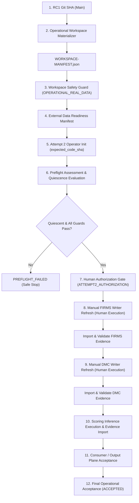

# SAPI Operations Plane RC1 — Operational Flow & Execution Guide

## Overview

This document specifies the authoritative operational flow for executing **Attempt 2** using the **Release Candidate 1 (RC1)** Operations Plane execution toolchain.

The toolchain integrates:
- **Canonical Operational Workspace Materializer** (`src/ops/operational_workspace.py`)
- **Workspace Safety Guard** (`src/ops/workspace_safety.py`)
- **Attempt 2 Operator & State Machine** (`src/ops/attempt2_operator/operator.py`)
- **Quiescence Engine** (`src/ops/attempt2_operator/quiescence/`)
- **Readiness Manifest Contracts**:
  - Workspace Manifest (`WORKSPACE-MANIFEST.json`)
  - Data Plane Manifest (`DATA-PLANE-MANIFEST.json`)
  - Output Plane Manifest (`OUTPUT-PLANE-MANIFEST.json`)
- **RC1 Diagnostic Command** (`python -m src.ops.attempt2_operator rc-status`)

> [!IMPORTANT]
> **Strict Operational Boundary**:
> Automated tools NEVER perform live refresh, container starts/stops, message dispatch, or store mutations without human action.
> Real execution remains strictly human-gated at all times.

---

## Architecture of the RC1 Operations Plane



---

## Step-by-Step Execution Sequence

### Step 1: Human Creation & Selection of RC1 Code SHA
The human operator identifies the authoritative git commit SHA intended for RC1 execution:
```bash
export RC1_CODE_SHA="<authoritative_40_char_sha>"
```
No run may proceed with an unknown or drifting SHA.

### Step 2: Canonical Operational Workspace Materialization
The operator materializes an isolated, verifiable operational workspace using the materializer tool:
```bash
python -m src.ops.operational_workspace materialize \
    --source-repo . \
    --target-dir ./workspaces/operational-rc1 \
    --sha "$RC1_CODE_SHA"
```
This produces:
- Clean code worktree checked out at `$RC1_CODE_SHA`.
- Verified store structure (`data/raw`, `data/processed`).
- Signed and fingerprinted `WORKSPACE-MANIFEST.json`.

### Step 3: Workspace Safety Guard Evaluation
Before any process touches the operational workspace, the safety guard validates the environment under `OPERATIONAL_REAL_DATA` mode:
```bash
python -m src.ops.workspace_safety check \
    --workspace ./workspaces/operational-rc1 \
    --mode OPERATIONAL_REAL_DATA \
    --json
```
**Safety Invariants**:
- Symlinks / NTFS reparse points / junctions are strictly forbidden (`TOPOLOGY_SAFE`).
- Uncommitted changes in the materialized workspace cause immediate `FAIL`.
- Source store integrity must be verified (`ow.verify()`).
- `INCOMPLETE` or `NOT_AVAILABLE` status must never be promoted to `PASS`.

### Step 4: External Data Readiness Manifest Generation
The data engineer or human operator establishes the data readiness manifest linking raw/processed sources:
- FIRMS raw Parquet and pointer status.
- DMC meteorological dataset status.
- Frozen model artifact (`models/model.pkl` or baseline artifact).
- Hito 1 validation benchmarks.

The resulting `DATA-PLANE-MANIFEST.json` contains SHA-256 fingerprints of all inputs and states `readiness: READY`.

### Step 5: Operator Run Initialization
Initialize the Attempt 2 Operator run directory:
`--evidence-root` and `--repo` are global flags and go before the subcommand; `--repo`
must be the materialized workspace (the operator verifies the workspace manifest against it):
```bash
python -m src.ops.attempt2_operator --evidence-root <EVIDENCE_ROOT> --repo <WORKSPACE> init \
    --expected-code-sha "$RC1_CODE_SHA" \
    --workspace-manifest <WORKSPACE>/OPERATIONAL-WORKSPACE-MANIFEST.json \
    --data-readiness-manifest <DATA_PLANE_MANIFEST.json>
```
This creates `<EVIDENCE_ROOT>/<RUN_ID>/` with `state.json`, `authorizations.json`,
`events.jsonl`, `manifest.json`, `snapshots/git_identity.json`,
`identity/rc1_execution_context.json`, and initial operator state `NEW`.
Do not pass the Output plane's `OUTPUT_PLANE_MANIFEST.json` here (see Step 11).

### Step 6: Preflight & Quiescence Evaluation
Run the automated preflight collection and validation:
```bash
python -m src.ops.attempt2_operator --repo <WORKSPACE> preflight --run <RUN_DIR> \
    --workspace-manifest <WORKSPACE>/OPERATIONAL-WORKSPACE-MANIFEST.json \
    --data-readiness-manifest <DATA_PLANE_MANIFEST.json>
```
Quiescence is evaluated here only; it is not re-checked by later transitions or imports,
and preflight cannot be re-run after authorization.
The quiescence engine inspects:
1. **Processes & Writers**: No active Python refresh processes (`firms_refresh`, `dmc_refresh`).
2. **Locks**: No active `.refresh.lock` files in `data/processed/firms` or `data/processed/dmc`.
3. **Container State**: Under `FIRST-CONTROLLED-REFRESH` policy, the n8n container must be **STOPPED**.
4. **Telegram**: Path must be verified `DISARMED`.
5. **Schedule**: Cron / activation schedules must be absent or disabled.

If all preflight checks pass, state transitions to `PREFLIGHT_READY`. Otherwise, state transitions to `PREFLIGHT_FAILED`.

### Step 7: Human Authorization Gate
Advancement to writer phases requires explicit human cryptographic or logged authorization:
```bash
python -m src.ops.attempt2_operator authorize --run <RUN_DIR> \
    --gate ATTEMPT2_AUTHORIZATION \
    --actor "Daniel Cortez"
```
State transitions: `PREFLIGHT_READY` -> `ATTEMPT2_AUTHORIZATION_REQUIRED` -> `ATTEMPT2_AUTHORIZED`.

### Step 8: Manual FIRMS Writer Refresh
1. Human authorizer issues FIRMS writer token:
   ```bash
   python -m src.ops.attempt2_operator authorize --run <RUN_DIR> --gate FIRMS_WRITER_AUTHORIZATION --actor "Daniel Cortez"
   ```
2. Operator advances to `FIRMS_RESULT_PENDING`.
3. Human runs the FIRMS refresh manually in the operational workspace:
   ```bash
   python -m src.refresh.firms_refresh refresh
   ```
4. Human builds the payload from the captured stdout/stderr, exit code and timestamps
   (flags are computed from the published store, never defaulted) and imports it:
   ```bash
   python -m tools.ops.attempt2_evidence --repo <WORKSPACE> writer-payload --phase firms \
       --stdout firms.out --stderr firms.err --exit-code <N> \
       --started-at <ISO> --finished-at <ISO> --out firms_evidence.json
   python -m src.ops.attempt2_operator import-result --run <RUN_DIR> --phase firms --from firms_evidence.json
   ```
5. Operator validates exit code, logs sanitization, Parquet schema, and pointers. State transitions to `FIRMS_VALIDATED`.

### Step 9: Manual DMC Writer Refresh
1. Human authorizer issues DMC writer token:
   ```bash
   python -m src.ops.attempt2_operator authorize --run <RUN_DIR> --gate DMC_WRITER_AUTHORIZATION --actor "Daniel Cortez"
   ```
2. Operator advances to `DMC_RESULT_PENDING`.
3. Human runs the DMC refresh manually:
   ```bash
   python -m src.refresh.dmc_refresh refresh
   ```
4. Human builds and imports the payload (same builder, `--phase dmc`):
   ```bash
   python -m src.ops.attempt2_operator import-result --run <RUN_DIR> --phase dmc --from dmc_evidence.json
   ```
5. Operator validates exit code, pointer, quality, and non-modification of Attempt 1 baseline. State transitions to `DMC_VALIDATED`.

### Step 10: Scoring Execution & Evidence Import
1. Operator advances to `SCORING_READY`.
2. With only the bridge started (after both writers are validated), capture the score
   with ONE GET. The same response body yields the accepted-run artifact, `bridge.json`
   and `scoring.json`; two separate GETs never bind (the artifact includes `age_hours`):
   ```bash
   python -m tools.ops.attempt2_evidence --repo <WORKSPACE> capture-bridge \
       --url http://127.0.0.1:8600/score --out <RUN_DIR>/capture
   ```
3. Import the scoring payload:
   ```bash
   python -m src.ops.attempt2_operator import-result --run <RUN_DIR> --phase scoring --from <RUN_DIR>/capture/scoring.json
   ```
4. Operator validates:
   - 50 grid cells populated.
   - Distinct live input fingerprint vs. frozen reference fingerprint.
   - Model SHA validation.
   State transitions to `SCORING_VALIDATED`.

### Step 11: Output Plane Manifest Acceptance
1. Operator advances to `BRIDGE_READY`.
2. Use the accepted-run artifact written by `capture-bridge` in Step 10 (its path and
   `artifact_fingerprint` are printed there). Do not capture again: a second GET is a
   different score and fails `verify` with `score_artifact_not_this_bridge_result`.
3. Build the per-run acceptance record in the Operations consumer contract. It is built
   from the persistent Output plane manifest (anchored fingerprint) and that artifact:
   ```bash
   python -m src.convergence.output_acceptance build --run-id <RUN> \
       --output-manifest <OUTPUT_PLANE_MANIFEST.json> --expect-output-fingerprint <fp> \
       --accepted-run <accepted-run.json> --expect-artifact-fingerprint <fp> --out <run dir>
   ```
   The Output plane's own `OUTPUT_PLANE_MANIFEST.json` is plane readiness evidence, not the
   per-run record. The Operations consumer rejects it if it is passed directly. For the same
   reason, do not pass it to `init --output-manifest`: `init` records the fingerprint without
   enforcing verification.
4. Check that the record belongs to this run and to the bridge result being imported
   (another run, another score or an older score is rejected):
   ```bash
   python -m src.convergence.output_acceptance verify <run dir>/OUTPUT-PLANE-MANIFEST.json \
       --output-manifest <OUTPUT_PLANE_MANIFEST.json> --expect-output-fingerprint <fp> \
       --run <RUN_DIR> --bridge bridge.json
   ```
5. Bind the record while importing the bridge result (there is no separate `accept-output`
   command):
   ```bash
   python -m src.ops.attempt2_operator import-result --run <RUN> --phase bridge \
       --from bridge.json --output-manifest <run dir>/OUTPUT-PLANE-MANIFEST.json
   ```
6. Step through manual review of downstream orchestrations (`N8N_MANUAL_READY`). The
   n8n phase evidence is policy-level: the inactive preview workflow must equal
   `ops/n8n/build_workflow.build()` and `ops/n8n/policy.js` is evaluated with Node on the
   captured body and the three fail-closed responses. The n8n runtime is not executed
   (`n8n_runtime_executed: false`):
   ```bash
   python -m tools.ops.attempt2_evidence --repo <WORKSPACE> n8n-evidence \
       --bridge-body <RUN_DIR>/capture/bridge-body.json --out n8n_evidence.json
   python -m src.ops.attempt2_operator import-result --run <RUN_DIR> --phase n8n --from n8n_evidence.json
   ```

### Step 12: Final Operational Acceptance
1. Operator advances to `ACCEPTANCE_READY`.
2. Final acceptance check executes:
   ```bash
   python -m src.ops.attempt2_operator next --run <RUN> --advance
   ```
3. State transitions to `ACCEPTED`.
4. Run report generation:
   ```bash
   python -m src.ops.attempt2_operator report --run <RUN>
   ```
5. Only after `ACCEPTED`, open the Control Center live
   (`python -m app.control_center --live`). Telegram and the schedule remain separate human
   gates and are not part of this flow.

> [!CAUTION]
> **Scientific Integrity Rule**:
> The final report and state explicitly certify:
> - `software_operational_acceptance`: **TRUE**
> - `scientific_model_validation`: **FALSE**
>
> Operational acceptance certifies software, pipeline, schema, and quiescence correctness. It does NOT constitute scientific validation of the predictive wildfire risk model.

---

## Diagnostic Command Reference

To inspect readiness at any time without mutating system state:
```bash
python -m src.ops.attempt2_operator rc-status --json
```

It is diagnostic only: `data_manifest_ready` is always false in `rc-status`, so it never
reports all prerequisites ready and exits 2. The authoritative gate is `preflight`.

This read-only command evaluates:
1. `code_identity_ready`: Working tree clean and matching RC1 commit.
2. `workspace_ready`: Operational workspace present, clean, and uncorrupted.
3. `data_manifest_ready`: Validated data readiness manifest present.
4. `quiescence_ready`: Strict quiescence policy satisfied.
5. `output_contract_known`: Presentation artifact schema established.
